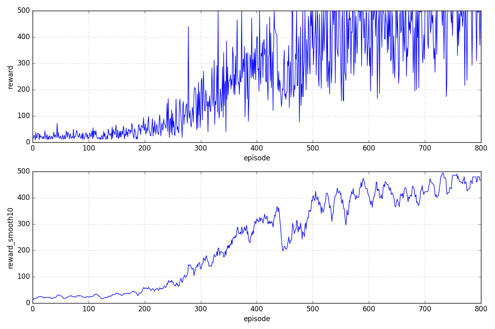
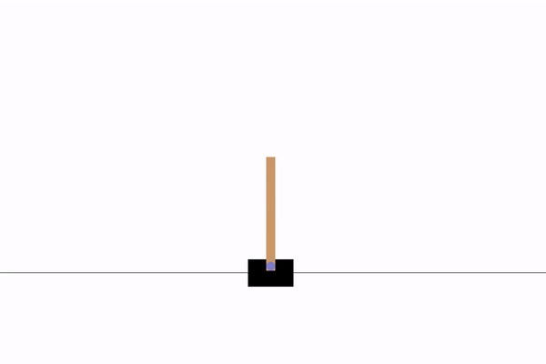

## Common Deep Reinforcement Learning Models (Tensorflow + OpenAI Gym)

In this repo, I implemented several classic deep reinforcement learning models in Tensorflow and OpenAI gym environment. Please check the corresponding blog post: ["Implementing Deep Reinforcement Learning Models"](http://lilianweng.github.io/lil-log/2018/05/05/implementing-deep-reinforcement-learning-models.html) for more information.

I will add more model implementation in the future.


### Setup

(1) Make sure you have [Homebrew](https://docs.brew.sh/Installation) installed:
```
/usr/bin/ruby -e "$(curl -fsSL https://raw.githubusercontent.com/Homebrew/install/master/install)"
```

(2) Then set up virtualenv.

```
# Install python virtualenv
brew install pyenv-virtualenv

# Create a virtual environment of any name you like with Python 3.6.4 support
pyenv virtualenv 3.6.4 workspace

# Activate the virtualenv named “workspace”
pyenv activate workspace
```

(3) (In the virtual env) Install OpenAI gym according to the [instruction](https://github.com/openai/gym#installation). For a minimal installation, run:
```
git clone https://github.com/openai/gym.git 
cd gym 
pip install -e .
```
If you are interested in playing with Atari games or other advanced packages in the gym environment, Please go with the gym [instruction](https://github.com/openai/gym#installation) further.


(4) Clone the code repo and install the requirements.
```
git clone git@github.com:lilianweng/deep-reinforcement-learning-gym.git
cd deep-reinforcement-learning-gym
pip install -e .  # install the “playground” project.
pip install -r requirements.txt  # install required packages.
```


### Train Models

The model configuration can be fully represented in a json file. I have a couple example config files in `playground/configs/data/`.

Start a model training as follows,

```bash
cd playground
python learn.py configs/data/reinforce-cartpole-v1.json
```

During training, three folders will be created in the root directory: `logs`, `checkpoints` and `figs`. Because the env is wrapped by `gym.wrappers.Monitor`, the gym training log is written into `/tmp/` in the meantime. Feel free to comment that out in `playground.configs.manager.ConfigManager` if you are not a fan of that.

Meanwhile, you can start the tensorboard,
```bash
tensorboard --logdir=logs
```

Once the training is complete, two figures are generated in `figs/`.






